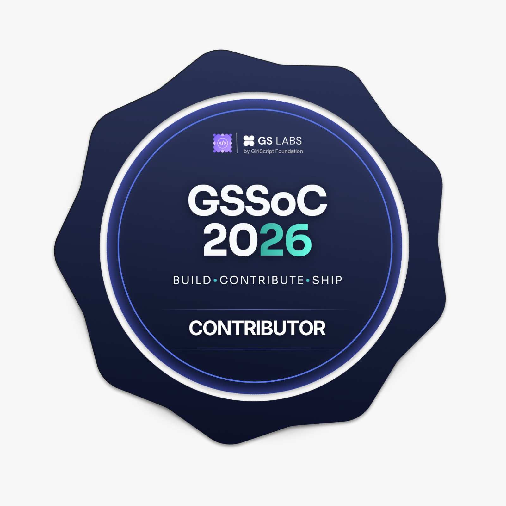
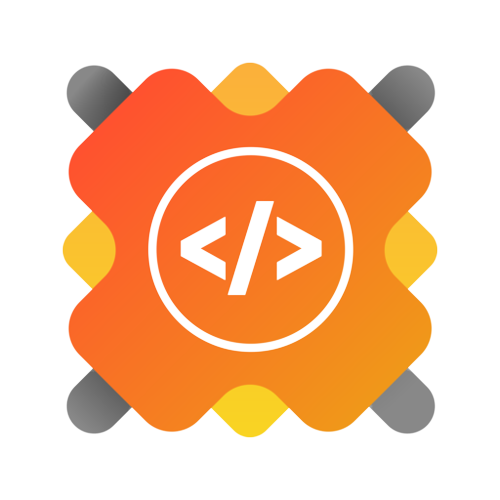

<h1> ⋆ 𐙚 Hey! I'm Tajalli Us Samad ⋆ </h1>

<h3> Engineering Undergrad (2nd Year) | Learning DSA | Exploring UI/UX</h3>

  

## ✦ What I'm Currently Learning

-  **Data Structures & Algorithms**
-  **UI / UX Design**
-  **Web Development**
-  **Applied Machine Learning**

---

## ✦ **Tech Stack**

## ✦ Featured Projects

### eConsultAI

Link : https://sentiment-analysis--sih.vercel.app/
- Built an NLP model to classify sentiment in text data
- 🏆 Won **Internal Smart India Hackathon (SIH)** at ABES ENGINEERING COLLEGE
- Implemented using Python and machine learning techniques

### MedBot

Link : https://huggingface.co/spaces/Krapter12/CHATBOT
- AI chatbot made to help medical pofessionals/students (deployed on **Hugging Face Spaces**)
- Built using Python and NLP tools
---

## ✦ Community & Experience

- Open Source Contributor at <b>GirlScript Summer of Code (GSSoC) '26</b>
- Coordinator at <b>Google Developer Groups (GDG) on Campus ABESEC</b> 

  
  
  

---

### ✦ Connect With Me

  

  

---

  
# Designing interfaces, building ideas, and learning something new everyday! 🚀
